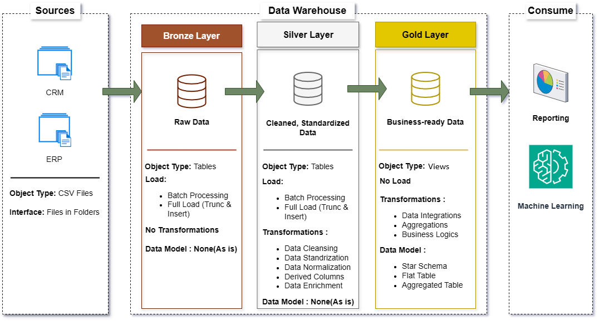

# Data Warehouse and Analytics Project 🚀

Welcome to the **Data Warehouse and Analytics Project** repository! This project demonstrates a comprehensive data warehousing and analytics solution—from raw data ingestion to actionable insights. It is designed as a portfolio project to highlight industry best practices in **data engineering**, **ETL**, **data modeling**, and **analytics**.  

---

## 🏗️ Data Architecture

This project follows **Medallion Architecture** with **Bronze, Silver, and Gold layers**:  

- **Bronze Layer:** Stores raw data exactly as it comes from source systems (CSV files from ERP and CRM) in SQL Server.  
- **Silver Layer:** Cleans, standardizes, and normalizes the data to prepare it for analytical modeling.  
- **Gold Layer:** Contains business-ready data modeled in a **star schema** for reporting and analytics.  

---

## 📖 Project Overview

This project includes the following components:

1. **Data Architecture:** Design a modern data warehouse using the **Medallion Architecture** (Bronze → Silver → Gold).  
2. **ETL Pipelines:** Extract, transform, and load data from multiple source systems into the warehouse.  
3. **Data Modeling:** Create **fact and dimension tables** optimized for analytical queries.  
4. **Analytics & Reporting:** Generate SQL-based reports and dashboards for insights into business operations.  

---

## 🎯 Skills Demonstrated

This repository is an excellent resource to showcase expertise in:

- SQL Development  
- Data Engineering & Architecture  
- ETL Pipeline Development  
- Data Modeling (Star Schema, Fact & Dimension Tables)  
- Data Analytics & Business Intelligence  

---

## 🛠️ Tools & Resources

Everything required for this project is free to use:

- **Datasets:** ERP and CRM CSV files for raw data.  
- **SQL Server Express:** Lightweight SQL Server instance.  
- **SQL Server Management Studio (SSMS):** GUI to manage databases.  
- **Git & GitHub:** Version control and collaboration.  
- **Draw.io:** Design data architecture, data flow, and models.  
- **Notion:** Project template and step-by-step project tasks.  

---

## 🚀 Project Requirements

### **Data Engineering – Building the Data Warehouse**
**Objective:**  
Develop a modern data warehouse in SQL Server to consolidate sales and customer data for analytics.  

**Specifications:**  

- **Data Sources:** ERP and CRM CSV files.  
- **Data Quality:** Clean and standardize before analysis.  
- **Integration:** Merge multiple sources into a single analytical model.  
- **Scope:** Latest datasets only (no historical tracking required).  
- **Documentation:** Provide clear schema and data catalog for stakeholders.  

---

### **Data Analysis – BI & Reporting**
**Objective:**  
Provide SQL-based analytics to uncover insights about:  

- Customer behavior  
- Product performance  
- Sales trends  

These insights enable stakeholders to make **data-driven decisions**.  

---

## 📂 Repository Structure

📦 data-warehouse-project/
│
├── 📁 datasets/                        # Raw datasets used for the project (ERP and CRM data)
│   ├── 📁 source_crm/                  # CRM system datasets
│   │   ├── 📄 cust_info.csv            # Customer information
│   │   ├── 📄 prd_info.csv             # Product information
│   │   └── 📄 sales_details.csv        # Sales transaction details
│   └── 📁 source_erp/                  # ERP system datasets
│       ├── 📄 CUST_AZ12.csv            # Customer master data from ERP
│       ├── 📄 LOC_A101.csv             # Location master data
│       └── 📄 PX_CAT_G1V2.csv          # Product category details
│
├── 📁 docs/                            # Project documentation and architecture
│   ├── 📝 ETL.md                        # Overview of ETL processes and techniques
│   ├── 🖼️ 2_data_architecture.png       # Data architecture diagram
│   ├── 📝 3_naming_conventions_followed.md # Naming conventions for tables, columns, and files
│   ├── 🖼️ 4_data_integration.png        # Data integration diagram
│   ├── 🖼️ 5_data_flow.png               # Data flow diagram
│   ├── 🖼️ 6_data_model.png              # Data models (star schema / fact-dimension)
│   └── 📝 7_data_catalog.md             # Dataset catalog with field descriptions and metadata
│
├── 📁 scripts/                         # SQL scripts for ETL and transformations
│   ├── 📁 bronze/                       # Scripts for extracting and loading raw data
│   │   ├── 📄 ddl_bronze.sql            # DDL for bronze tables
│   │   └── 📄 proc_load_bronze.sql      # Procedure to load bronze layer
│   ├── 📁 silver/                       # Scripts for cleaning and transforming data
│   │   ├── 📄 ddl_silver.sql            # DDL for silver tables
│   │   └── 📄 proc_load_silver.sql      # Procedure to load silver layer
│   ├── 📁 gold/                         # Scripts for creating analytical models
│   │   └── 📄 ddl_gold.sql              # DDL for gold tables
│   └── 📄 init_database.sql             # Script to initialize database and schemas
│
├── 📁 tests/                            # Test scripts and quality checks
│   ├── 📄 quality_checks_silver.sql     # Data quality checks for silver layer
│   └── 📄 quality_checks_gold.sql       # Data quality checks for gold layer
│
├── 📝 README.md                         # Project overview, instructions, and usage
├── 📄 LICENSE                           # License information for the repository
├── 📄 .gitignore                        # Files and directories ignored by Git
└── 📄 requirements.txt                  # Dependencies and requirements for the project

---

## 🌟 About Me

Hi! I’m **Apon Kumar Das**, a tech enthusiast and aspiring **Data Engineer**. I’m passionate about **technology, data, and building robust data solutions**.  

This repository showcases my learning journey and hands-on projects in **Data Warehousing, ETL pipelines, and data modeling**. It’s my way of sharing knowledge, demonstrating growth, and building a **professional data engineering portfolio**.  

📚🌱 I’m eager to learn, grow, and connect with others in the data engineering community:  
  
